Introduction
============

This Installation and Administration Guide covers Knowage Server. Any feedback on this document is highly welcome, including bugs, typos or things you think should be included but are not. Please create issues on our [Knowage tracker](https://www.knowage-suite.com/jira/) also for this purpose.

Installation
============

This page contains the basic Installation and Administration Guide for the Knowage Server, the reference implementation of the Data Visualization Generic Enabler, based on the [Knowage](http://www.knowage-suite.com) Open Source project. Its [Community Edition Manual](http://download.forge.ow2.org/knowage/Knowage_6.x_CE_Manual.pdf) is continuously updated and improved, and provides the most appropriate source to get the most up-to-date information on installation and administration. Other community tools are available, such as a [Q&A](https://www.knowage-suite.com/qa/) and a [tracker](https://www.knowage-suite.com/jira/).

In this page we'll provide you some basic information, but we'll focus on the integration between Knowage Server and other GEs, in particular with the IdM - KeyRock, Data Lab - CKAN and the Orion Context Broker.

Released package description
----------------------------

Knowage Server is a collection of web applications (core application "knowage" plus external engines "knowage\*\*\*engine").

Requirements
------------
-   a Java application server (e.g. Apache Tomcat)
-   JDK 1.7;
-   a relational Database for storing Knowage Metadata (MySQL, Oracle, Postgres, Ingres or HSQLDB);
-   a set of external libreries (commons-logging, commons-logging-api, oswego-concurrent, geronimo-commonj, foo-commonj)
-   the specific JDBC library for the relational Database which we were referring before (e.g. mysql-connector-java)
-   R (http://cran.r-project.org/) and Python (https://www.python.org/) needed only for advanced data-mining and social analysis (optional).

Data to be analyzed with Knowage can be stored both on SQL datasources and NoSQL datasources.

Installation from installer
----------------------------------
You can install Knowage from the released installer [here](https://forge.ow2.org/project/showfiles.php?group_id=442). Please check also the related documentation  
[here](http://download.forge.ow2.org/knowage/Knowage-CE-Installer-GettingStarted.pdf).

Installation from released package
----------------------------------
We assume Apache Tomcat 7.0.57 has been chosen as application server and MySQL as relation databse for Knowage Metadata.
Please download all the required external libraries, as instance from the URLs below:
-   [commons-logging](https://search.maven.org/remotecontent?filepath=commons-logging/commons-logging/1.1.1/commons-logging-1.1.1.jar)
-   [commons-logging-api](https://search.maven.org/remotecontent?filepath=commons-logging/commons-logging-api/1.1/commons-logging-api-1.1.jar)
-   [oswego-concurrent](https://search.maven.org/remotecontent?filepath=org/lucee/oswego-concurrent/1.3.4/oswego-concurrent-1.3.4.jar)
-   [geronimo-commonj](https://search.maven.org/remotecontent?filepath=org/apache/geronimo/specs/geronimo-commonj_1.1_spec/1.0/geronimo-commonj_1.1_spec-1.0.jar)
-   [foo-commonj](http://commonj.myfoo.de/bin/foo-commonj-1.1.0.zip)
-   [mysql-connector-java](https://search.maven.org/remotecontent?filepath=mysql/mysql-connector-java/5.1.33/mysql-connector-java-5.1.33.jar)

We'll refer to the main folder of the application server as KNOWAGE\_SERVER\_HOME. After installation of the required softwares and download libraries listed before, you have to copy such libraries in the KNOWAGE\_SERVER\_HOME/lib folder. The metadata database must be created and configured in KNOWAGE\_SERVER\_HOME/conf/server.xml:

``` xml
<Resource name="jdbc/knowage" auth="Container"
          type="javax.sql.DataSource" 
          driverClassName="your JDBC driver class"
          url="your JDBC URL"
          username="your JDBC username"
          password="your JDBC password" 
          maxActive="20" maxIdle="10"
          maxWait="-1"/>
```

providing JDBC URL, username, password and driver class. Refer to the database documentation about the right JDBC driver to be used, and put it in KNOWAGE\_SERVER\_HOME/lib folder. Then edit the following files in order to set the proper dialect for the database:

-   KNOWAGE\_SERVER\_HOME/webapps/Knowage/WEB-INF/classes/hibernate.cfg.xml (set hibernate.dialect property according to your database)
-   KNOWAGE\_SERVER\_HOME/webapps/Knowage/WEB-INF/classes/jbpm.hibernate.cfg.xml (set hibernate.dialect property according to your database)
-   KNOWAGE\_SERVER\_HOME/webapps/Knowage/WEB-INF/classes/quartz.properties (set org.quartz.jobStore.driverDelegateClass property according to your database)

Then you have to configure some environment variables defined in KNOWAGE\_SERVER\_HOME/conf/server.xml:

``` xml
    <Environment name="hmacKey" description="HMAC key" type="java.lang.String" value="abc123"/>
    <Environment name="resource_path" type="java.lang.String" value="${catalina.base}/resources"/>
    <Environment name="sso_class" type="java.lang.String" value="it.eng.spagobi.services.common.FakeSsoService"/>
    <Environment name="service_url" type="java.lang.String" value="http://localhost:8080/knowage"/>   
    <Environment name="host_url" type="java.lang.String" value="http://localhost:8080"/>
```
-   hmacKey contains the secret to authenticate calls between different engines. You **must** change it, and **do not** distribuite it;
-   resource\_path contains a reference to a path in the file system, this will be used in order to store static resources such images, i18n files, etc: you can set it as default ${catalina.base}/resources but check writing permissions;
-   sso\_class is a Java class that is specific for a SSO system; default value is it.eng.spagobi.services.common.FakeSsoService but you can change it when using an SSO solution (see Knowage online documentation for details);
-   service\_url is an URL used by the external engines to communicate with Knowage core; since Knowage core and external engines are installed on the same application server, you can leave it as "localhost";
-   host\_url is the URL that is used by the client browsers to communicate with Knowage; you **must** change it to the actual Knowage URL.

Installation with provided scripts
----------------------------------

It's possible to install Knowage into an Ubuntu 16.04 machine, using this command:

```
curl https://raw.githubusercontent.com/KnowageLabs/Knowage-Server-Chef/master/bin/installation.sh | ssh -i <identity file> <sudo user>@<ip of machine>
```

which installs a clean Knowage running on MySQL.

Then you can access Knowage on `http://<ip of machine>:8080/knowage`.

Integration with R environment
----------------------------------

It is required the installation of the following components for the correct operation of the data mining engine:

-   R
-   R Studio
-   rJava

The first two components, needed for the functionality of the Knowage data mining
engine, has to be installed through the rpm comand, and, the third, through the RStudio GUI.
Once retrieved the RPM file, open the folder and launch the comands:
```bash
rpm -Uvh ./R-3.2.2-1.el6.x86_64.rpm
yum install --nogpgcheck rstudio-server-rhel-0.99.486-x86_64.rpm
cp ./RStudio/rJava_0.9-8.tar.gz $TOMCAT_HOME
chown tomcat $TOMCAT_HOME/rJava_0.98.tar.gz
chown -R tomcat.root /usr/lib64/R/library && chmod -R 775 /usr/lib64/R/library
chown -R tomcat.root /usr/share/doc/R-3.2.2 && chmod -R 775 /usr/share/doc/R-3.2.2
```

Typing the address `http://<ip of machine>:8787/` in the browser, the user gets
on login page. Log in with the user credentials used for the Tomcat 7 installation: `tomcat / <tomcat_user_password>`.
The following figures show the steps that must be performed:

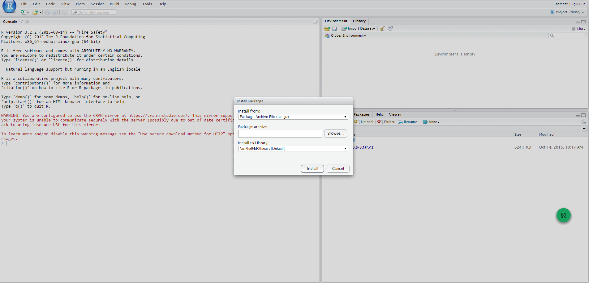
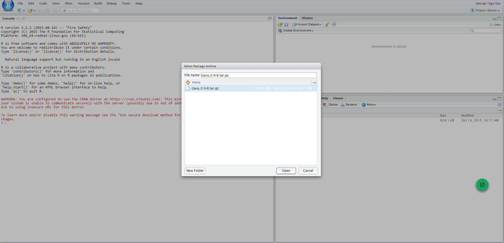
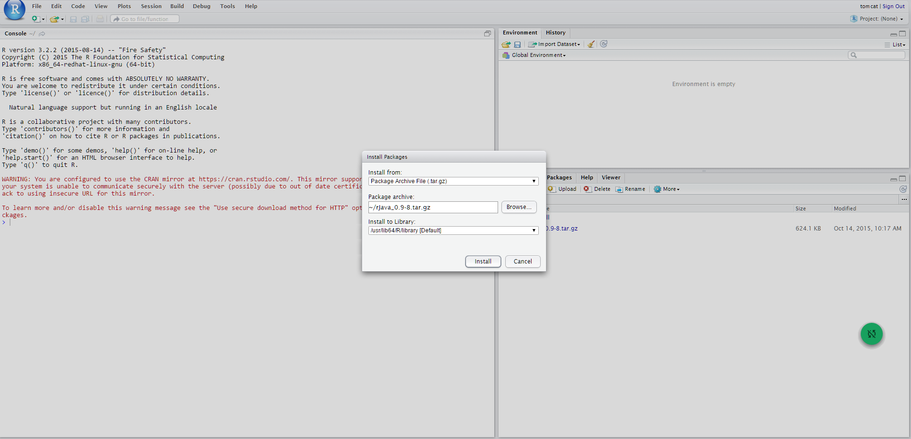

Meanwhile the package is installed, remember to answer NO when asked to create a personal library in the user home (that can be found under `$HOME/RStudio/log`). This way, rJava will be installed in the directory `/usr/lib64/R/library/rJava`.

Finally, edit the `TOMCAT_HOME/bin/setenv.sh` adding the following:
```bash
export R_HOME=/usr/lib64/R
export LD_LIBRARY_PATH=/usr/lib64/R/library/rJava/jri
```

Integration with Python environment
----------------------------------

The engine uses a Java/Python interface, which allows to submit scripts and get result from a Python environment already installed on the machine where the Datamining Engine runs. For this reason, Python environment need to be installed on the same machine of Knowage server. This implies that, in order to run this engine, you have to install Python properly (depending on the OS) on the same machine where Knowage is installed. You can find all information about Python installation at `https://www.python.org`. Datamining engine only support Python 3 (the product has been tested with Python 3.4.0, but other 3.x releases are supported).

###  JPY installation
JPY is a connector that make possible a bidirectional communication between Python and Java and its components must be installed on both sides (Datamining engine and Python environment). Datamining engine is shipped with `jpy.jar` that allows the communication, but this is not sufficient, because JPY must be installed on your Python environment. To do this you have to download the JPY source files and build them by yourself on your machine (unfortunately pre-built packages are not made available yet by JPY creators). All the detailed instructions to build and install JPY on your Python environment are described on the page `http://jpy.readthedocs.org/en/stable/install.html`. During the testing phase Python
3.4 and JPY 0.8 (stable version) have been used; here the version-specific installation steps are described.

You will need:
-  Python 3.3 or higher (3.2 may work as well but is not tested)
-  Oracle JDK 7 or higher (JDK 6 may work as well)
-  Maven 3 or higher
-  Microsoft Windows SDK 7.1 or higher If you build for a 32-bit Python, make sure to also install a 32-bit JDK. Accordingly, for a 64-bit Python, you will need a 64-bit JDK.

The Python setup tools (`distutils`) can make use of the command-line C/C++ compilers of the free Microsoft Windows SDK. These will by used by `distutils` if the `DISTUTILS_USE_SDK` environment variable is set. The compilers are made accessible via the command-line by using the `setenv` tool of the Windows SDK. In order to install the Windows SDK execute the following steps:

-  If you already use Microsoft Visual C\+\+ 2010, make sure to uninstall the x86 and amd64 compiler redistributables first. Otherwise the installation of the Windows SDK will definitely fail. This may also be applied to higher versions of Visual C\+\+.
-  Download and install Windows SDK 7.1.
-  Download and install Windows SDK 7.1 SP1. Open the command-line and execute:
   1.  `"C:\Program Files\ Microsoft SDKs\ Windows\ v7.1\ bin\ setenv" /x64 /release`
to prepare a build of the 64-bit version of jpy.
   2.  `"C:Program Files\ Microsoft SDKs\ Windows\ v7.1\ bin\ setenv" /x86
/release` to prepare a build of the 32-bit version of jpy. Now set other environment
variables:
```bash
SET DISTUTILS_USE_SDK=1
SET JAVA_HOME=%JDK_HOME%
SET PATH=%JDK_HOME%\jre\bin\server;%PATH%
```

Then, to actually build and test the jpy Python module use the following command: `python setup.py install`.
To use JPY you need to replace the `jpyconfig.properties` file on your project, with the one generated by the build process that is present in your JPY built folder
`jpy-master\build\lib.<SO-CPU-PYTHON_versions>`. Properties file to replace is located in `knowagedataminingengine\src\`.
Datamining engine supports the use of all Python libraries: before import a library in yourscript install it on your native Python environment (for example using `pip`). To use Python you need to install the following libraries: 
-  `matplotlib`
-  `pandas`
-  `numpy`
-  `scipy`

You can install them using `pip` typing the following commands on your native Python console:
```bash
pip install pandas
pip install numpy
pip install scipy
pip install matplotlib
```

###  Example of Python document template
```xml
Example of Python Template
<?xml version="1.0" encoding="ISO-8859-15"?>
<DATA_MINING>
	<LANGUAGE name="Python"/>
	<DATASETS>
		<DATASET name="df" readType="csv" type="file" label="HairEyeColor" canUpload="true">
        	<![CDATA[sep=',']]>
        </DATASET>
	</DATASETS>
	<SCRIPTS>
		<SCRIPT name="test01" mode="auto" datasets="df" label="HairEyeColor" libraries="csv,os,pandas,numpy">
			<![CDATA[print(df.ix[0,0]) y=df.ix[0,0]]]>
		</SCRIPT>
	</SCRIPTS>
	<COMMANDS>
		<COMMAND name="testcommand" scriptName="test01" label="test01" mode="auto">
			<OUTPUTS>
				<OUTPUT type="text" name="first_element" value="y" function="" mode="manual" label="first_element"/>
			</OUTPUTS>
		</COMMAND>
	</COMMANDS>
</DATA_MINING>
```
Note that the `LANGUAGE` tag is used to specify the language to use: `name=Python` and `name=R` are supported. If the `LANGUAGE` tag is not present or name is not specified correctly, the default language is set to R.

How to start and stop Knowage Server
------------------------------------

In order to start Knowage Server, you have to execute KNOWAGE\_SERVER\_HOME/bin/startup.bat (for Windows systems) or KNOWAGE\_SERVER\_HOME/bin/startup.sh (for Linux systems); use shutdown.bat or shutdown.sh to stop it. You can also install Knowage Server as a service, please refer to Tomcat documentation.

Users configuration
-------------------

If you start Knowage Server with default configuration (i.e. configuration provided within the released package), at the first start, it will initialize a default tenant ("DEFAULT") with some predefined users (biadmin/biadmin that is superadmin, biuser/biuser that is a normal user). [Here below](#Configuration_with_the_IdM_-_KeyRock "wikilink") we describe the configuration that permits you to use IdM - KeyRock as the users repository.

How to define a new JDBC datasource
-----------------------------------

In order to define a new JDBC datasource, we recommend to define it as a JNDI resource. Proceed as follows:

-   stop Knowage Server
-   edit KNOWAGE\_SERVER\_HOME/conf/server.xml and add a new datasource (here below we call it "mydatasource", but of course you can change the name)

``` xml
<Resource name="jdbc/mydatasource" auth="Container"
          type="javax.sql.DataSource" 
          driverClassName="your JDBC driver class"
          url="your JDBC URL"
          username="your JDBC username"
          password="your JDBC password" 
          maxActive="20" maxIdle="10"
          maxWait="-1"/>
```

-   put a valid JDBC driver in folder KNOWAGE\_SERVER\_HOME/lib
-   delete folder KNOWAGE\_SERVER\_HOME/conf/Catalina/localhost
-   edit all knowage\*/META-INF/context.xml and add a new line:

``` xml
<ResourceLink global="jdbc/mydatasource" name="jdbc/mydatasource" type="javax.sql.DataSource"/>
```

-   start Knowage Server
-   enter web GUI with superadmin credentials, then enter Resources --&gt; Data Source
-   define a new JNDI datasource with JNDI name "java:comp/env/jdbc/mydatasource"

How to define temporary storage for datasets cache
--------------------------------------------------

Knowage caches datasets into a temporary storage, that is actually a JDBC datasource. The configuration of this datasource is mandatory for ad-hoc reporting functionalities. You need to define a JDBC datasource (MySQL, HSQLDB, ...) as described in the above paragraph, but pay attention that this datasource should be configured (in the Knowage web GUI detail page) as "Read and write" and "Write default", and it must be enabled in all tenants.

Configuration with the IdM - KeyRock
====================================

This chapter describes the integration between Knowage and the IdM GE - KeyRock (REST API version 3), giving step-by-step instructions on how to configure Knowage and how to define organizations and roles in IdM for Knowage usage. The integration between Knowage and the IdM was developed in order to let people authenticate through the IdM, and his roles (defined in the IdM) to be inherited by Knowage. The configuration procedure is divided into 3 high-level steps:

-   create account and application in FIWARE Lab;
-   change Knowage settings;
-   restart Knowage server and exploit the integration

In this document we will see all of these steps in details and we will also see how to properly manage FIWARE users within the IdM. We will consider the IdM instance provided by [FIWARE Lab](https://account.lab.fiware.org/) as the reference example.

FIWARE account and application creation
---------------------------------------

**Disclaimer:** this chapter is not intended to be an exhaustive description of KeyRock, it gives only informations about its integration with Knowage. For more details about KeyRock please refer to its [documentation](http://forge.fiware.org/plugins/mediawiki/wiki/fiware/index.php/Identity_Management_-_KeyRock_-_User_and_Programmers_Guide).

In order to create new application in the IdM you have to open your browser first and connect to [FIWARE Lab](https://account.lab.fiware.org/). If you don't have an account click on “Sign up” under the “Sign in” form in the left: this account will be used as Knowage super administrator.

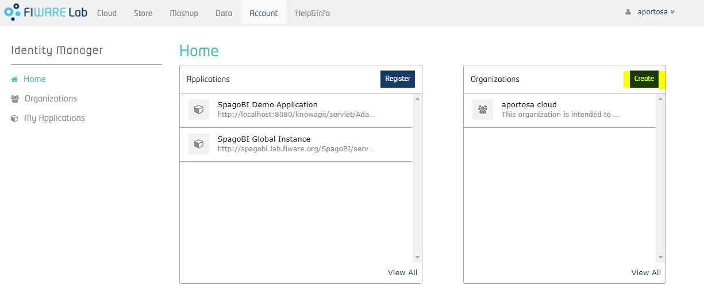

Now let's define an organization within the IdM; for this purpose, we'll create it with another user that is "Knowage User":

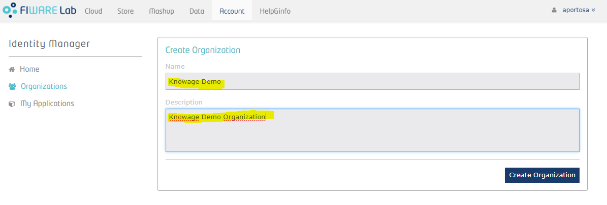

Once an organization is created, the owner can always switch between User account and Organization account. He only has to click over his name in the top right corner, put mouse over “Switch session” and select the account he wants to manage:

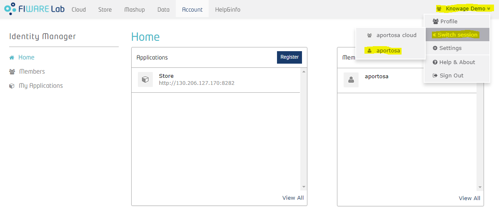

Using the Organization account, he can manage the organization: more precisely, he can add new members and assign roles to them. We will talk more about roles later on.

Next step consists on creating the application with your administrator account. In order to do so, click on “My Applications” on the left menu and press the "Register" button. A 3-steps wizard will be diplayed: in the first step you have to put application's information, such as name, description, URL and callback URL. Last one is part of OAuth2 standard and it is the URL where a user has to be redirected (by the IdM) after he gives the application his permission to access some of his information.

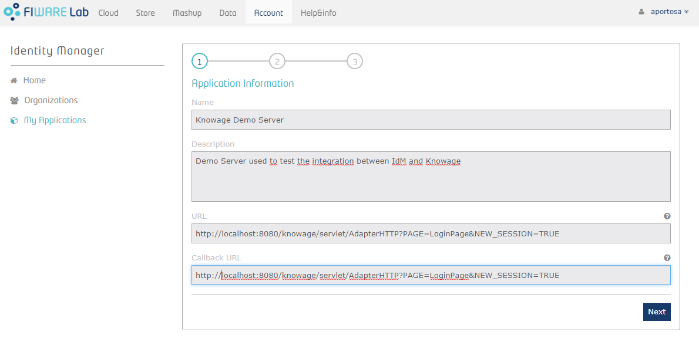

In second step you can insert the logo of your application.

Third step requires to manage roles. There are already two predefined roles, Provider and Purchaser, but you can add your custom roles. Once Knowage is properly configured, roles will be imported automatically in its metadata (roles are the basis for the visibility rules over document and data in Knowage, therefore they are actually copied in Knowage metadata database). In Knowage there are 4 different kind of roles:

-   admin roles have administration privileges
-   dev roles have development privileges
-   test roles have test privileges
-   model\_admin roles have privileges to manage the behavioural model
-   user roles have no technical privileges, they are intended for final users

Knowage recognizes the type of role applying a regular expression (we will see it later): by default, role "admin" is considered as an admin role, and "user" as normal role for final users.

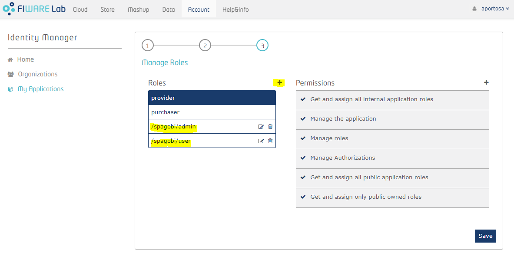

After the third step, the application is created! Next picture shows the application's home page:

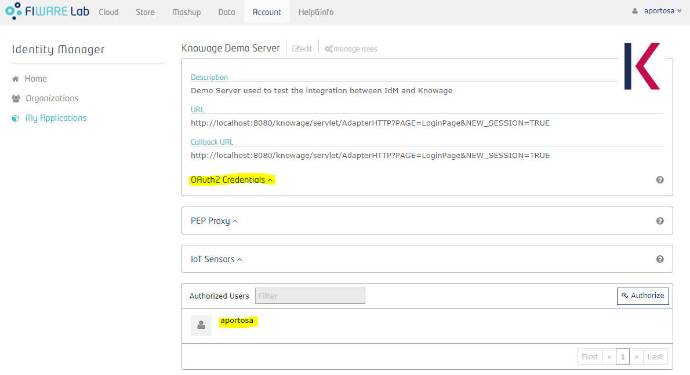

You can see application details and the list of authorized users and groups (at the bottom). Now you need to get the OAuth2 credentials: enter the details of the application and click on "OAuth2 Credentials": you can see the Client ID and the Client Secret. These informations are part of the OAuth2 standard and they will be used by Knowage in order to communicate with the IdM.

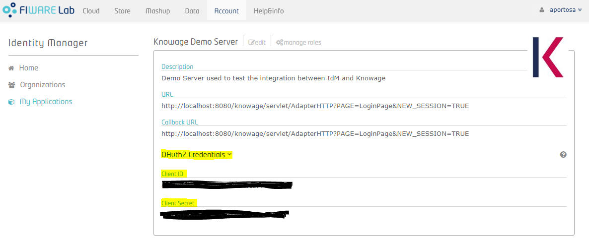

In order to manage users associated with the application, go back to the application page, in the “Authorized” box. For each user you can add or remove roles by selecting the ones provided by the drop-down menu:

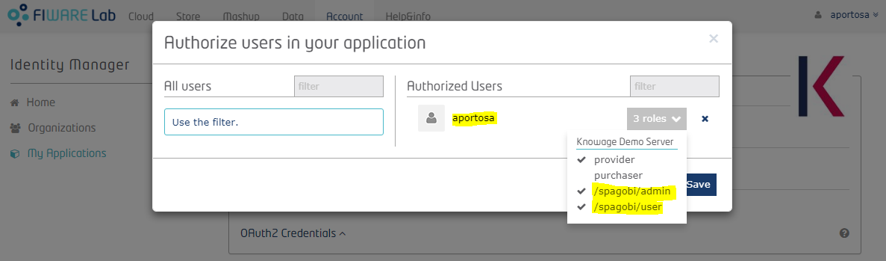

The available roles are “Provider”, “Purchaser” (these will be ignored by Knowage) and all the custom roles defined during application registration. You can assign more than one role to one user. If no roles are assigned to an user, he will enter Knowage with a default role that can be set within Knowage by the administrator. See next chapter for more details.

Inside the “Authorized” box you can also add users to the application by clicking on the “Add” button on the right.

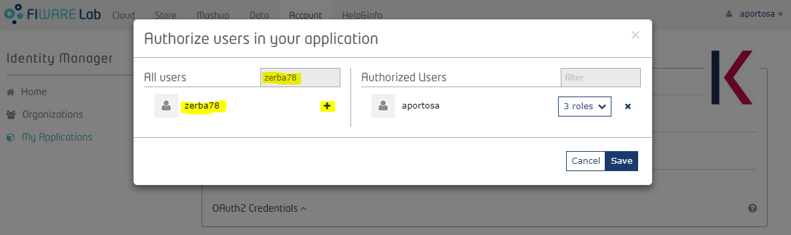


Users added in the application directly (i.e. not within an organization) will belong to the default tenant in Knowage, which name is "DEFAULT".

It's possible to add organizations in the application in the exact same way as we did for users. Those organizations will be considered as separated tenants in Knowage. As we've seen before, an organization's administrator can assign roles to members within the IdM: this will be reflected in Knowage where corresponding tenant's members will have those roles. In order to use organizations properly, they must have “Provider” or “Purchaser” role in the application, otherwise the administrator would not be able to give application's roles to organization's members.

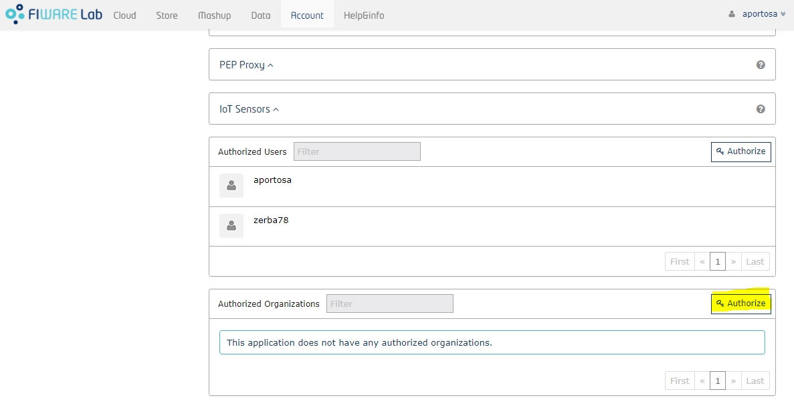


In other words, if an organization is added as Provider or Purchaser, its owner can give applications roles to whoever he wants. As said before, if you are an organization owner and you switch to the Organization account, you can manage roles of organization's members. The way you do that is very similar as how the application roles are assigned within the application's page: for each organization member there is a drop-down menu with the available roles: this list is comprehensive of roles of all applications for whom the organization is authorized.

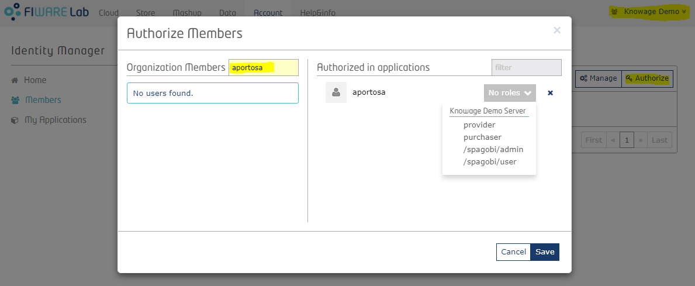

The above image shows how, for an organization owner, it is possible to give Application custom roles (in this case, the two roles defined before: _admin_ and _user_) to a member of the organization.

Pay attention to the fact that, since Knowage doesn't allow users to belong to more than one tenant, in case an user has application's roles distributed in more than one organization, only one tenant will be assigned to him and only roles associated with the corresponding organization will be considered by Knowage. Default tenant has priority over the others, so if an user is added directly in the application (not within an organization) and also by an organization owner, he will belong to "DEFAULT" tenant and his roles will be the ones defined by the application administrator. If an user belongs to different organizations, there are no particular rules on how tenant will be chosen, so you should avoid this situation.

Knowage configuration
---------------------

In order to authenticate in Knowage using FIWARE Lab accounts, Knowage has to be configured properly. In this chapter we will explain how to achieve that.

First of all, start Knowage normally: as explained before, the default tenant is created and some default users are created. Then enter with the default super administrator user, that is biadmin/biadmin; then, enter "Configuration management" as in picture below:

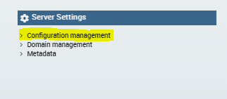

You will see the main Knowage Server configuration table. Each row correspond to one parameter, its value is stored in the VALUE\_CHECK column.

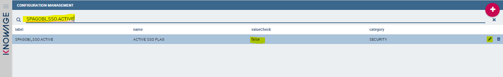

Change the following settings (change their VALUE\_CHECK property):

```
SPAGOBI_SSO.ACTIVE = true
SPAGOBI.SECURITY.PORTAL-SECURITY-CLASS.className = it.eng.spagobi.security.OAuth2SecurityInfoProvider
SPAGOBI.SECURITY.USER-PROFILE-FACTORY-CLASS.className = it.eng.spagobi.security.OAuth2SecurityServiceSupplier
SPAGOBI_SSO.SECURITY_LOGOUT_URL = https://account.lab.fiware.org
```

Beyond previous settings, there are other configurations that can be made (optional):

```
SPAGOBI.SECURITY.ROLE-TYPE-PATTERNS.DEV_ROLE-PATTERN
SPAGOBI.SECURITY.ROLE-TYPE-PATTERNS.TEST_ROLE-PATTERN
SPAGOBI.SECURITY.ROLE-TYPE-PATTERNS.MODEL_ADMIN-PATTERN
SPAGOBI.SECURITY.ROLE-TYPE-PATTERNS.ADMIN-PATTERN
SPAGOBI.SECURITY.DEFAULT_ROLE_ON_SIGNUP
```

The first four are patterns used by Knowage to recognize new roles and give them particular privileges. For example, the default VALUE\_CHECK for SPAGOBI.SECURITY.ROLE-TYPE-PATTERNS.ADMIN-PATTERN is "/spagobi/admin". When a user with this role enters Knowage, he is recognized as administrator. You can change these patterns and permit Knowage to import roles with different names than the default ones. The last one (SPAGOBI.SECURITY.DEFAULT\_ROLE\_ON\_SIGNUP) is the role given to a user that authenticates for the first time and who doesn't have any particular roles. At this point, you need to stop Knowage server to activate SSO with the IdM. First of all, edit KNOWAGE\_SERVER\_HOME/conf/server.xml and set sso\_class variable as it.eng.spagobi.services.oauth2.Oauth2SsoService:

``` xml
<Environment name="sso_class" type="java.lang.String"
       value="it.eng.spagobi.services.oauth2.Oauth2SsoService"/>
```

Then edit KNOWAGE\_SERVER\_HOME/webapps/knowage/WEB-INF/web.xml: activate the Oauth2Filter (in the default package it is disabled):

``` xml
<!-- START OAUTH 2 -->
<filter>
    <filter-name>OAuthFilter</filter-name>
    <filter-class>it.eng.spagobi.security.oauth2.OAuth2Filter</filter-class>
</filter>
<!-- END OAUTH 2 -->
```

and the corresponding filter mapping

``` xml
<!-- START OAUTH 2 -->
<filter-mapping>
    <filter-name>OAuthFilter</filter-name>
    <url-pattern>/servlet/AdapterHTTP/*</url-pattern>
</filter-mapping>
<!-- END OAUTH 2 -->
```

The file containing the OAuth2 parameters is configs.properties, deployed inside the library knowageutils.jar. To change those parameters, it is necessary to extract the contents of such library and modify them. Once the modification is done and saved, the JAR library has to be created and deployed inside each Knowage engine in order to share the new OAuth2 configuration.

As instance, for the Knowage Core Engine, edit KNOWAGE\_SERVER\_HOME/webapps/knowage/WEB-INF/lib/knowageutils.jar/it/eng/spagobi/security/OAuth2/configs.properties and set:

-   CLIENT\_ID and SECRET has to be copied from FIWARE Lab application detail page inside "Oauth2 Credentials" section
-   AUTHORIZE\_URL contains the URL used to retrieve the access code as specified in OAuth2 standard (when using FIWARE Lab instance use <https://account.lab.fiware.org/oauth2/authorize>)
-   ACCESS\_TOKEN\_URL contains the URL used to retrieve the token (given the access code) as specified in OAuth2 standard (when using FIWARE Lab instance set it as <https://account.lab.fiware.org/oauth2/token>)
-   USER\_INFO\_URL contains the URL used to retrieve users' information as specified in OAuth2 standard (when using FIWARE Lab instance set it as <https://account.lab.fiware.org/user>)
-   REDIRECT\_URI must contain the URL specified as "Callback URL" in the application details
-   REST\_BASE\_URL is the url of IdM REST services (when using FIWARE Lab instance set it as <http://cloud.lab.fiware.org:4730/v3/>)
-   TOKEN\_PATH contains the URL path that has to be invoked if you want to obtain the authentication token of an user. It is used, together with REST\_BASE\_URL, ADMIN\_EMAIL and ADMIN\_PASSWORD, to retrieve administrator's authorization token to extract application details (when using FIWARE Lab instance set it as auth/tokens)
-   ROLES\_PATH contains the URL path that has to be invoked if you want to obtain the list of application's roles (when using FIWARE Lab instance set it as OS-ROLES/roles)
-   ORGANIZATIONS\_LIST\_PATH is the URL path that has to be invoked if you want to obtain the list of application's organizations (when using FIWARE Lab instance set it as OS-ROLES/organizations/role\_assignments)
-   ORGANIZATION\_INFO\_PATH contains the URL path that has to be invoked if you want to obtain informations about an organization (when using FIWARE Lab instance set it as projects/)
-   APPLICATION\_ID is the id of the FIWARE Lab application. To obtain the correct id of the application, open its detail page and look at the browser URL (for example, in FIWARE Lab instance, if your application page's URL is <https://account.lab.fiware.org/idm/myApplications/id_number/>, the APPLICATION\_ID is "id\_number")
-   ADMIN\_ID is the id of the administrator on IdM. To obtain it, open the user page on the IdM (by clicking on the name of the user on the top right part of the page) and and look at the browser URL (for example, in FIWARE Lab instance, if your user page's URL is <https://account.lab.fiware.org/idm/users/id_number/>, the ADMIN\_ID is "id\_number")
-   ADMIN\_EMAIL and ADMIN\_PASSWORD are the administrator credentials specified during administrator registration

The default settings were configured considering the FIWARE Lab instance, therefore, if you want to use the same instance, you have only to set the following properties: CLIENT\_ID, SECRET, REDIRECT\_URI, APPLICATION\_ID, ADMIN\_ID, ADMIN\_EMAIL and ADMIN\_PASSWORD.

To enable multi-tenancy, edit KNOWAGE\_SERVER\_HOME/webapps/knowage/WEB-INF/conf/config/initializer.xml and substitute MetadataInitializer with OAuth2MetadataInitializer:

``` xml
<!-- Initializer for Knowage metadata -->
<INITIALIZER class="it.eng.spagobi.commons.initializers.metadata.OAuth2MetadataInitializer" config="" />
```

Finally, if your Knowage Server is behind by a proxy, you have to set its configuration in the JVM's arguments of the Tomcat process:

-   -Dhttp.proxyHost=<your proxy host>
-   -Dhttp.proxyPort=<your proxy port>
-   -Dhttp.proxyUsername=<your proxy user>
-   -Dhttp.proxyPassword=<your proxy password>
-   -Dhttp.nonProxyHosts="localhost|127.0.0.1"

That's it! After restarting Knowage server you should be able to sign in using a FIWARE account!

Knowage notifications from external sources (Orion Context Broker)
---------------------
In order to make Knowage able to be notified, it's necessary to modify some parameters. These parameters are necessary to be able to notify from [Orion Context Broker OCB](https://github.com/telefonicaid/fiware-orion).

Open the file edit KNOWAGE\_SERVER\_HOME/webapps/knowage/WEB-INF/web.xml and change:

```xml
		<init-param>
			<param-name>notifyUrl</param-name>
			<param-value>http://192.168.93.1:8080/knowage/datasetNotifier</param-value>
		</init-param>
```

with your Knowage host url, for example:

```xml
		<init-param>
			<param-name>notifyUrl</param-name>
			<param-value>http://www.my-personal-spagobi.com:8080/knowage/datasetNotifier</param-value>
		</init-param>
```

This url is used by OCB to send notifications to Knowage.


Using FIWARE IdM and Knowage
----------------------------

At this point, if you invoke Knowage by your browser, you are redirected into FIWARE IdM instance.

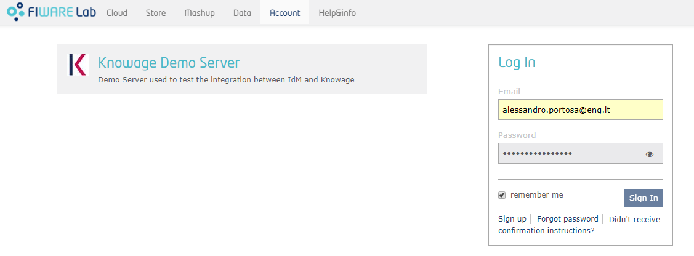

Once logged in, FIWARE IdM will ask you to authorize the application:

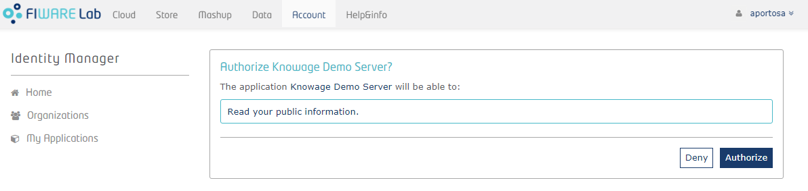

Of course you have to authorize the application, and you will sent back to Knowage. As already explained, if the user has no roles defined by the IdM, he will enter Knowage with a default role specified in Knowage configurations.

In this case, the application administrator can add roles to that user (the user has to logout and login again in order to benefit of it). If the user has already been added with some roles for the application, he will automatically inherit those roles in Knowage.


The application administrator can always change roles of the users (the ones who belong to "DEFAULT" tenant) within the IdM. Organization owners can always change roles of members (and these members will belong to a tenant with the same name of the organization).

Pay attention to the fact that, if a new tenant is added (in FIWARE IdM as organization), Knowage Server doesn't recognize it automatically unless you restart it.


Copy Link to share analysis
----------------------------

With Knowage 6.2 version it has been introduced possibility for a user, after executing a document, to share execution of document also to non authenticated users

###  Public role
The first step is the definition of a public role.

The public role is defined by administrator, with a checkbox on role definition. There can be only one public role for each tenant and knowage checks no more than one role for tenant is marked as public.

Once set the public role administrator is responsible to assign permissions to folders and drivers and decide which documents can be shared to anonymous users.


###  Copy Link and Emebed in HTML menu buttons
Two menu buttons in document execution toolbar are available

-   copy link
-   embed in HTML

By clicking on it the document execution url is showned and user can copy it.

If the current document is executable by public role the url shown will have the form public/servlet/Adapter, this means that anybody even if not authenticated on knowage can invoke the URL and see the document execution.


###  The anonymous user
Everyone who receives a shared public URL can execute the document even if not authenticated by knowage; this applies only if the document is stille executable by public role, otherwise system gives error.


Signup functionality
----------------------------
By setting to true the config variable SPAGOBI.SECURITY.ACTIVE_SIGNUP_FUNCTIONALITY the signup functionality is activated, it appears as a "register" button in login page

### The registration procedure
By clicking on REGISTER button user can acceed to registration page and provide following data:
-   name and surname
-   userId, password and password confirmation
-   email
-   a security captcha

after filling all informations and clicking on REGISTER button the user is inserted into database (unless userId is already present, in which case a warning is given), but in a "Not active" state.

An e-mail is sent to provided address containing a link for validation (it contains a validation timestamp so has a limited validity).

After clicking on this link the registration is completed and user can login.

### Configurations for signup
On configurations page can be set some configurations for signup functionality (to find them open "Configuration management" from administration menu and write "signup" on search bar).
They include:
-   expiring time for validity link
-   subject and text for the validation mail
-   the default role given to newly registered user (usually a user role)
-   the default tenant given to newly registered user
-   as wrote before, the activation flag for the whole signup function

### If you do not receive a confirmation mail
If after clicking "register" from registration form a error message is shown or you are not automaticcaly redirected to login page it is likely that your e-mail configurations are not correctly set.

Take a look at configurations regarding mail and make sure you correctly set port (MAIL.PROFILES.user.smtpport), user and password of a proxy if present (MAIL.PROFILES.user.user and MAIL.PROFILES.user.password).
