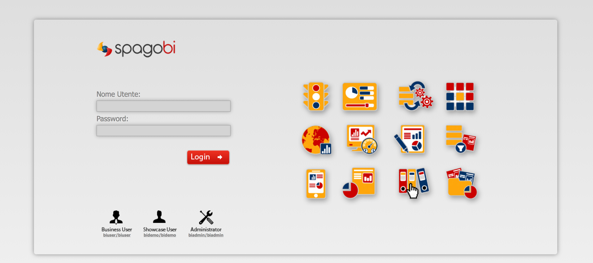

#<a name="top"></a>Sanity check procedures

* [End to End Testing](#end-to-end-testing)
* [List of Running Processes](#list-of-running-processes)
* [Network Interfaces Up and Open](#network-interfaces-up-and-open)
* [Databases](#databases)

The Sanity Check Procedures are the steps that a System Administrator will take to verify that an installation is
ready to be tested. This is therefore a preliminary set of tests to ensure that obvious or basic malfunctioning
is fixed.

## End to End Testing

*   Start SpagoBI on default port (8080)
*   Open SpagoBI on your browser at url

> [http://localhost:8080/SpagoBI](http://localhost:8080/SpagoBI)

*   Check that you see the login page:




[Top](#top)

## List of Running Processes

A java Tomcat process should be up and running, e.g.:

```
$ ps aux | grep java
root        15  1.3 18.4 2034464 745708 ?      Sl   08:55   2:34 /usr/bin/java -Djava.util.logging.config.file=/usr/local/tomcat/conf/logging.properties -Djava.util.logging.manager=org.apache.juli.ClassLoaderLogManager -Djava.endorsed.dirs=/usr/local/tomcat/endorsed -classpath /usr/local/tomcat/bin/bootstrap.jar:/usr/local/tomcat/bin/tomcat-juli.jar -Dcatalina.base=/usr/local/tomcat -Dcatalina.home=/usr/local/tomcat -Djava.io.tmpdir=/usr/local/tomcat/temp org.apache.catalina.startup.Bootstrap start
```

[Top](#top)

## Network Interfaces Up and Open

SpagoBI uses Servlet Application Container (Tomcat), 8080 is the default port.

[Top](#top)

## Databases

SpagoBI uses a JDBC connection therefore it can uses every Database with a JDBC driver. The All In One version contains a [HSQL DB](http://hsqldb.org), inside a folder. It runs when SpagoBI runs. Other versions (not All I One) of SpagoBI run normally with an external database, usually a MySQL database. To check if a MySQL instance is running with SpagoBI database run these commands:

Run mysql client:

```
$ mysql -u root -p 
```

Show the tables of spagobi database:

```
mysql> use spagobi; show tables;
+----------------------------------+
| Tables_in_spagobi                |
+----------------------------------+
| JBPM_ACTION                      |
| JBPM_BYTEARRAY                   |
| JBPM_BYTEBLOCK                   |
...
```

[Top](#top)