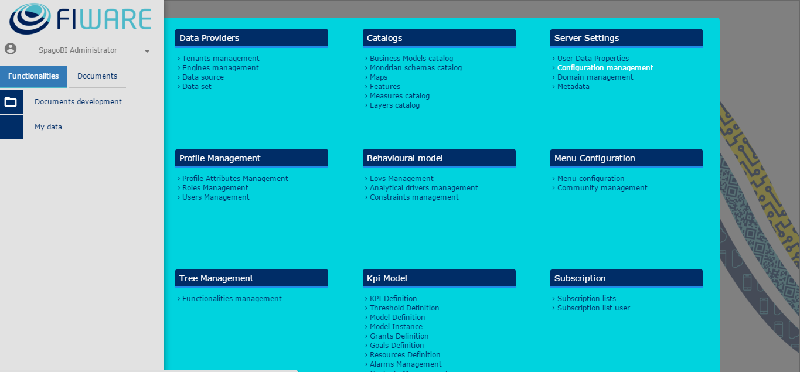
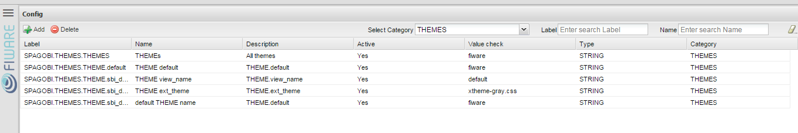
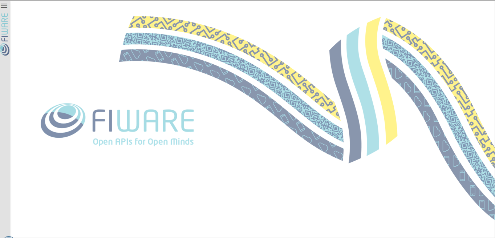
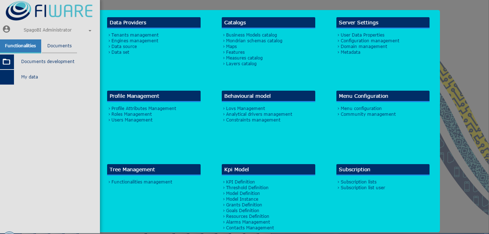
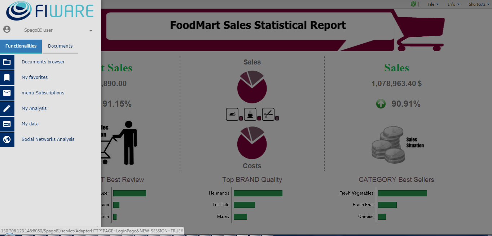
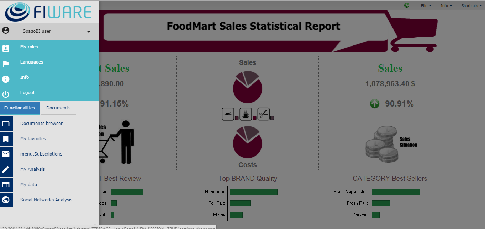
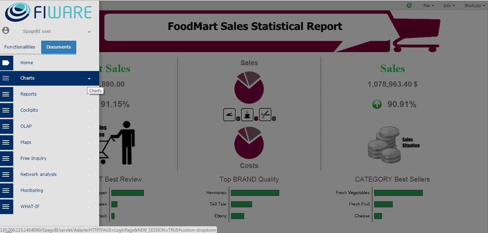
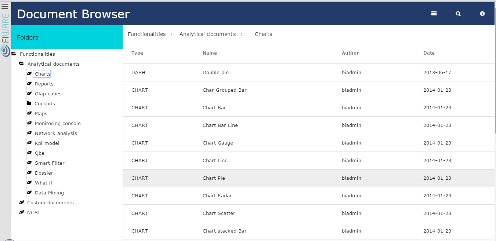
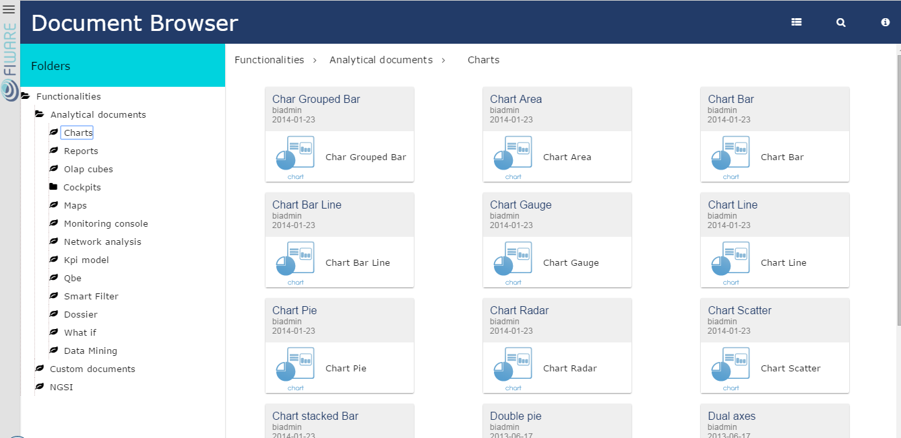
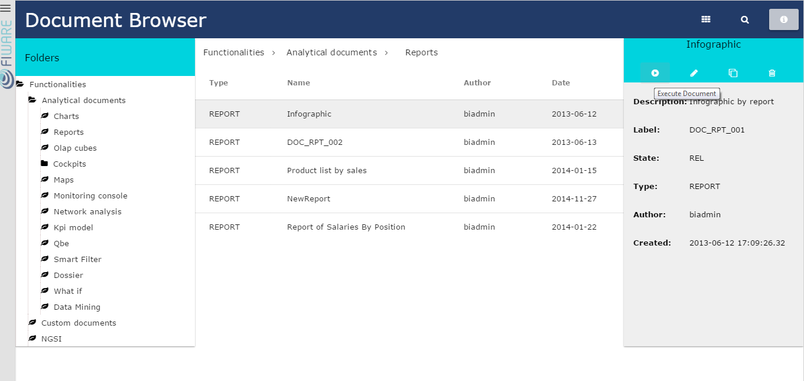

# FIWARE Theme

* [Configure theme](#configure-theme)
* [Admin theme](#admin-theme)
* [User theme](#user-theme)

SpagoBI has a specific theme for FIWARE. This section explains how to configure it and provides some example screenshots.

## Configure theme

To use FIWARE theme administrator must open "Configuration management" from admin menu:

filter THEMES options and set them as shown in screenshot below.
  

## Admin theme

For what concerns administrator screenshot below shows homepage.

Next screenshot shows administrator menu

Document browser, that is available also for administrator, is shown with next section. 

## User theme
For what concerns user screenshot below shows user homepage

Next screenshot shows basic configurations menu like language, info, roles.

Next screenshot shows menu to quick find and execute documents.

Document browser is then shown, with both view modalities: list mode and folder mode

At last next screenshot shows menu when selecting a single document, with options to execute it, clone, delete etc.

