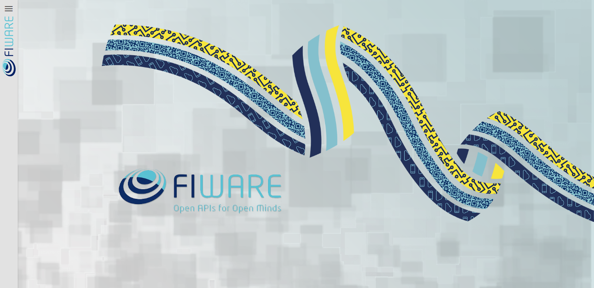
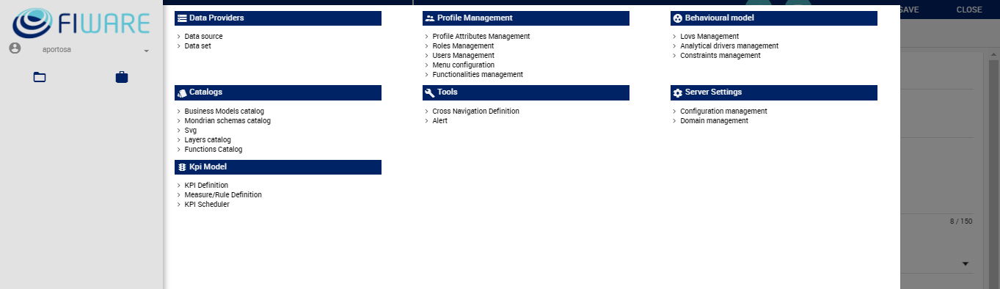
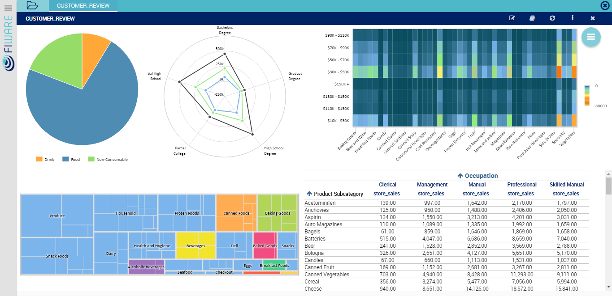

# FIWARE Theme

* [Configure theme](#configure-theme)
* [Screenshots](#screenshots)

Knowage has a specific theme for FIWARE. This section explains how to configure it and provides some example screenshots.

## Configure theme

We'll refer to the folder where Knowage is deployed as KNOWAGE_SERVER_HOME.

To use one of these themes, you can simply paste the subfolder <name_of_the_theme> (e.g. Knowage-Server/themes/FIWARE) into KNOWAGE_SERVER_HOME\webapps\knowage\themes.

## Screenshots

