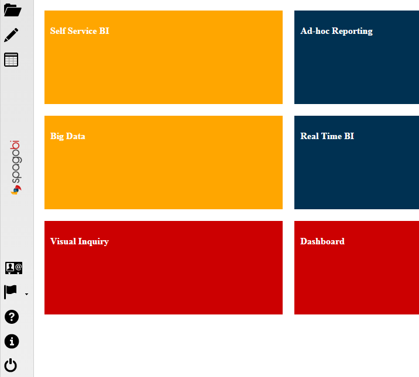
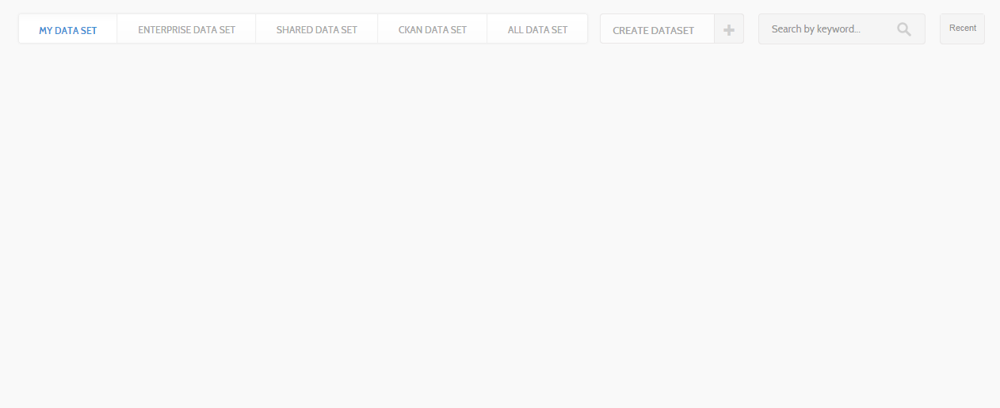
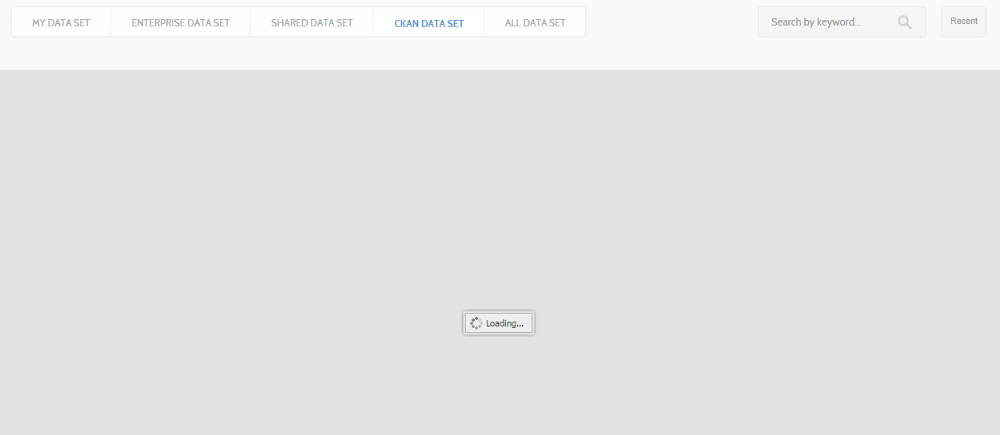
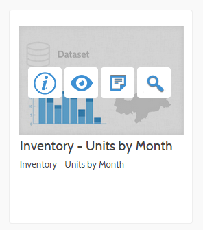
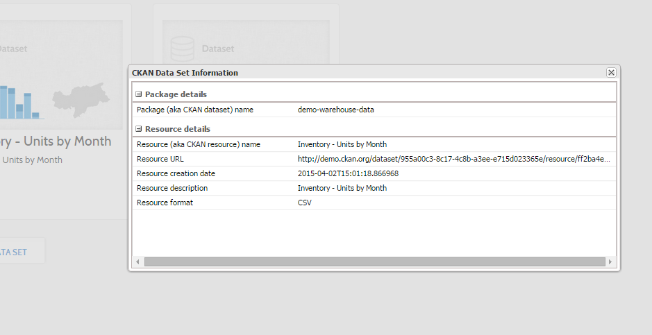
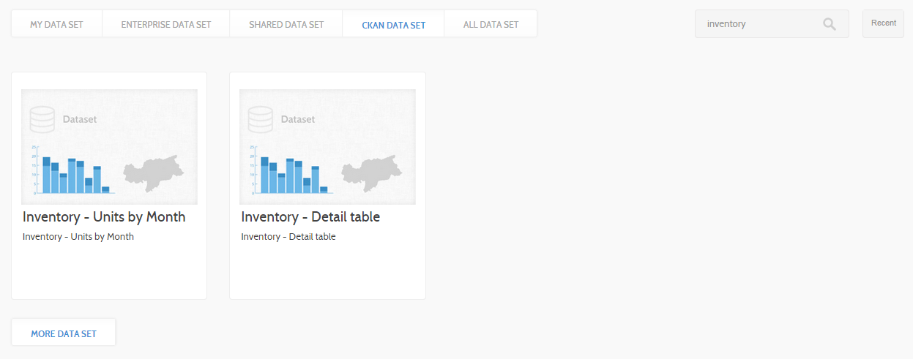
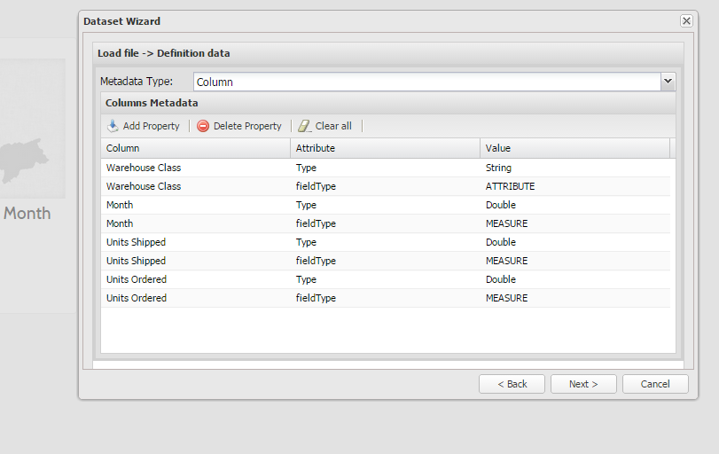
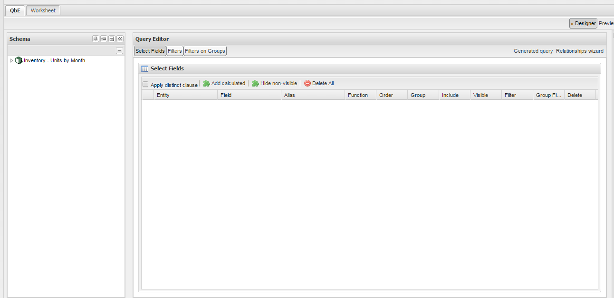
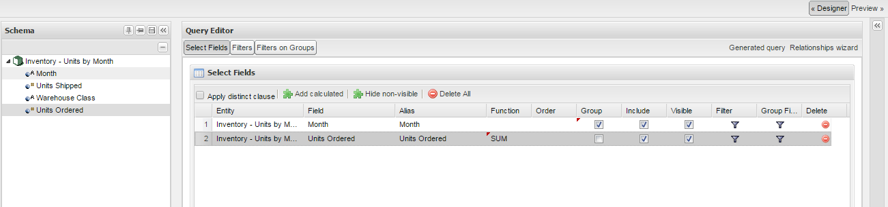

Knowage and CKAN: self-service opendata
=======================================

Introduction
============

What is CKAN?
-------------

CKAN is the world’s leading open-source data portal platform. It is a powerful data management system that makes data accessible – by providing tools to streamline publishing, sharing, finding and using data. CKAN is aimed at data publishers (national and regional governments, companies and organizations) wanting to make their data open and available.

Mission
-------

Knowage extends its set of data sources by providing native and out-of-the-box CKAN integration. By using such open data management system, Knowage grant access to the huge amount of dataset published in the World Wide Web (e.g. datahub.io, data.gov, data.lab.fiware.org, dati.gov.it, and more). SpagoBI allows now to search and handle opendata in a self-service manner, letting the users to integrate own dataset with external ones directly inside our suite. As instance, enterprise dataset can finally join opendata, bringing up the overall data value!

Integration 
============

Dataset mapping between Knowage and CKAN
----------------------------------------

The term *“dataset”* has two different meaning in Knowage and CKAN:

-   The former uses *dataset* to indicate a unique data resource. It can be anything: a CSV file, a SQL query against a DB, a Java class, and so on;

-   The latter indicates *dataset* as a set of resources, where the only the resource contains the data. A dataset basically acts as a container, or a data package, where details (such as visilibility, or scope) are inherit by its resources.

Because of this difference, there is no direct mapping between Knowage and CKAN datasets. Therefore, the current approach is to consider a CKAN resource as a Knowage dataset. It still keep a reference to the parent, but it is now self-contained and its handling is indipendent from the package (aka CKAN dataset). The dataset listing and searching functions in SpagoBI reflect this mapping, directly showing the CKAN resources as importable SpagoBI dataset.

CKAN dataset categories
-----------------------

CKAN dataset can be divided in four main categories:

-   Public;

-   Organization private;

-   Acquired;

-   User private.

Any dataset set with public visibility, regardless its owner, can be seen as element of the collection of dataset publicly available.

Instead, a private dataset owned by an organization can be seen only by the members of such organization.

Acquired datasets are purchased from the FIWARE Store, whereas user private datasets are intent to be used only by the owner and/or shared between other users, but keeping its private visibility.

CKAN dataset access method
--------------------------

So far, CKAN provides two different access method:

-   By using the dataset URL, so having direct access to the file;

-   Through the DataStore extension, which allow to query the datasets avoiding to exchange the whole dataset.

The current release of SpagoBI makes use of the first method, since it allows to execute data parsing and validation processes. Future release will probably add support for the second method, which will help to handle dataset with large amount of records/information.

Limits and future developments
------------------------------

The dataset data parsing and validation processes rely on the Knowage file dataset management system, where CSV and XLS file formats are supported. This means that only CKAN resources with such formats are taken into account by Knowage, filtering the datasets availability by their format. With the future support for other formats (e.g. XML), Knowage will automatically increase the availability of CKAN resources, enhancing the overall CKAN integration.

How to use Knowage with CKAN
============================

Configuration
-------------

Knowage fully integrate CKAN API, where only the following parameters are needed:

-   URL of the target CKAN instance;

-   Username;

-   REST API Key.

As stated in *“Limits and future developments”*, Knowage currently relies on the FIWARE Identity Manager. This choice ties the current release with the FIWARE Data Lab, avoiding FIWARE users to specify the second and third parameter considering that they are obtained through the OAuth2 authentication process.

The file containing the URL parameter is ***ckan.config.properties***, deployed inside the library ***knowageutils.jar***. To change the target CKAN instance, it is necessary to extract the contents of such library, modifying the parameter ***ckan.url*** with the preferred one. Once the modification is done and saved, the JAR library has to be created and deployed inside each Knowage engine in order to share the new CKAN configuration.

Explore the target CKAN repository
----------------------------------

To start using CKAN dataset inside Knowage suite, open the menu and click on **Workspace**. Then expand the **Data** section and click on **Datasets**.

The first tab (My Data Set) shows any dataset that belong to the user, plus any already imported CKAN resource. Click on the **CKAN Data Set** tab to start interacting with the configured CKAN instance.

-----------------------

By clicking on the tab and after the repository is selected, Knowage starts to interact with CKAN to obtain the first trunk of 200 CKAN datasets (exploding them into multiple CKAN resources). It usually takes between five and ten seconds, depending on the connection and network traffic situation.

The below image shows a list of CKAN resources mapped as CKAN datasets. These are not usable yet, but can start to handle them as we will show in the following. The dataset are shown with its name and description (see the red arrows). Other information (e.g. visibility, last modification date) are available with a specific **Info** action.

To have access to the other trunks of CKAN datasets, it is possible on the button **More Data sets**, placed at the top page. It will dinamically reload the current following trunk of datasets, if available.

-----------------------

Each dataset supplies a list of actions.

Clicking on the **Info** button, a set of information from the original CKAN resource will be shown by Knowage.

Knowage also enable searching CKAN-side, allowing user to directly access to a known dataset or to obtain a list of dataset starting from a specific keyword. As instance, in the following image the user searched for any CKAN resource/dataset containing the keyword *inventory*.

Let’s see how to use one of them, by simply import metadata information and then analyze the dataset on demand.

Save and handle dataset
-----------------------

If you want to use a dataset not used yet, any action on will start the metadata import wizard. Otherwise, the eye-like one is the button to start the import process.

If the dataset is correctly downloaded a successfull message will appear, plus a set of mandatory parameters to set the parser configuration.

The seconda step of the importing wizard is important to set how your final dataset will appear. Be careful to choose the appropriate data type (String, Integer, Double) and field type (Measure, Attribute). After that, click on next to see the validation results and confirm to finalize dataset import.

Now the dataset is imported, and it will appear in the **My Data Set** tab, ready to be use through Knowage inquiring and analytics tools.

Inquiring the data via Query by Example
---------------------------------------

Knowage offers a tool to inquire data: it is called Query by Example (QbE). It allows user to easily explore data. Click on the **Magnifier** icon to start working with the QbE.

From this point, the user can start to build query interacting with the GUI (e.g in the below image three fields have been selected).

To see the result in advance, the user can click use the **Smart Data** button (in the top-right position). The results are shown as a table.

Lastly, it is now possible to save the this new QbE as a new Knowage dataset (click on the **Save** icon in the top-right position).
