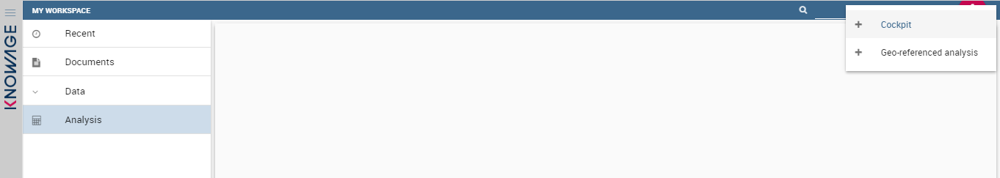
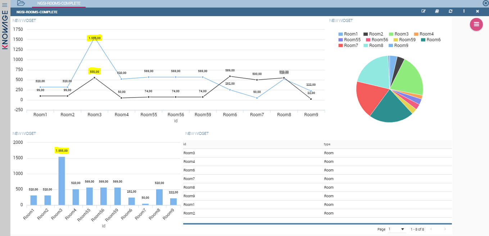
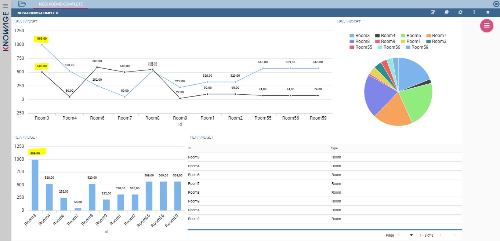
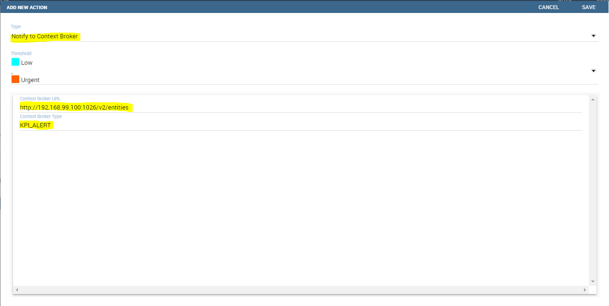

Knowage and NGSI
=======================================

Introduction
============

What is NGSI?
-------------
NGSI is a protocol developed by OMA to manage Context Information. It provides operations like:

* Manage the Context Information about Context Entities, for example the lifetime and quality of information.
* Access (query, subscribe/notify) to the available Context Information about Context Entities.

The FIWARE version of the OMA NGSI interface is a RESTful API via HTTP. Its purpose is to exchange context information. The two main interaction types are

* one-time queries for context information
* subscriptions for context information updates (and the corresponding notifications)

Mission
-------
Knowage extends its set of data sources by providing native and out-of-the-box NGSI integration. 
Knowage permits to create REST dataset of type NGSIv2 that show current information data and collects notifications of context updates in order to modify the data underneath the SpagoBI documents, using it.

Integration 
============

Dataset mapping between Knowage and NGSI
----------------------------------------
The term *dataset* in Knowage indicates a unique data resource. It can be anything: a CSV file, a SQL query against a DB, a Java class, and so on. In NGSI environment a standard Knowage *dataset* is a collection of Context Entities with their attributes. These Context Entities are retrieved from the NGSIv2 Provider (currently the [Orion Context Broker OCB](https://github.com/telefonicaid/fiware-orion)) through a REST call. The answer of this call represents the Context Entities in JSON format. 

The following examples are based on a demo. The `Meter` Context Element represents a power sensor: it saves the upstream and downstream active power in an instant of a prosumer (a producer/consumer of electricity).
So, for example a GET REST call query is:

	/v2/entities?type=Meter
	
It retrieves all entities of type `Meter`. The response will be something like:

	[
		{
			id: "pros1_Meter",
			type: "Meter",
			atTime: {
				type: "timestamp",
				value: "2015-11-28T19:14:54.001+0100",
				metadata: { }
			},
			downstreamActivePower: {
				type: "double",
				value: "2.06",
				metadata: { }
			},
			prosumerId: {
				type: "string",
				value: "pros1",
				metadata: { }
			},
			unitOfMeasurement: {
				type: "string",
				value: "kW",
				metadata: { }
			},
			upstreamActivePower: {
				type: "double",
				value: 99,
				metadata: { }
			}
		},
		{
			id: "pros2_Meter",
			type: "Meter",
			atTime: {
				type: "timestamp",
				value: "2015-11-28T19:14:54.001+0100",
				metadata: { }
			},
			downstreamActivePower: {
				type: "double",
				value: "3.06",
				metadata: { }
			},
			prosumerId: {
				type: "string",
				value: "pros2",
				metadata: { }
			},
			unitOfMeasurement: {
				type: "string",
				value: "kW",
				metadata: { }
			},
			upstreamActivePower: {
				type: "double",
				value: "2.13",
				metadata: { }
			}
		}
	]

In the above example we have two Context Elements with the following attributes:

* atTime
* downstreamActivePower
* prosumerId
* unitOfMeasurement
* upstreamActivePower

The related Knowage dataset will contain these entities with the related attributes mapped with the types defined in the response.

How to use Knowage with NGSIv2
============================

DataSet creation
----------------
Defining a REST NGSIv2 DataSet in Knowage is like to define any other type of DataSet. We need to create a REST DataSet and then make it NGSI enable.
At the homepage of application, click on DataSet:


then create a DataSet clicking on the '+' icon and fill all main fields (name, label, etc.):


Now click on Type tab, select REST type and fill all the mandatory fields plus click on NGSI checkbox:


In particular, you must define at least:

* the Orion Query Context URL
* the HTTP Method
* check NGSIv2 checkbox

The fields for items and attributes are written in [JSON Path Notation](https://github.com/jayway/JsonPath), which is similar to XML XPath notation, which are usually used to obtain data from a generic REST dataset where the data structure is different from case to case.

**NGSIv2 checkbox** is specific for NGSIv2 REST calls: it permits to subcribe to Context Element notifications from Orion Context Broker and to omit some of the REST fields (since the JSON format from NGSI specifications is fixed).

**IMPORTANT NOTE:** if you want to exploit the Context Broker publish/subscribe paradigm and enable analyses to be automatically updated, you must provide an URL with **only one** the following query parameters:

* id
* idPattern

The former will subscribe to a specific entity based on the provided id, while the latter will subscribe to any entity which id match the idPattern provided. Futher information about those aspects can be found in the Context Broker docs.

If you click on preview button you can see the current data retrieved from OCB defined:


At the end of DataSet definition lick on Save button in the upper-right cornet to save the DataSet.

Document definition
-------------------
A *Document* in Knowage environment permits to use the DataSet previous created to make reports, statistics, visualization of data etc.. 

### Cockpit Engine

In the following example we create a Document of type *Cockpit* because is strictly related to REST NGSIv2 DataSet. With this type of Document you can see the notifications of Context Elements changes from OCB in real time.
So, start to build a Cockpit by creating a new document in the Workspace:



Create widgets selecting the previously created datasets and save the document. Execute it and you will now see the data retrieved from OCB:



Now we modify a Context Element (please use your preferred application to make REST calls). The change is immediately reflected on Cockpit Document: the bar chart goes up/down and the related values in table changes accordingly:



**IMPORTANT NOTE:** please notice that, while creating a chart widget through its chart designer, you can only use the **id** entity as category.

### Chart Engine

In addition to Cockpit Engine it's also possible to add notifications capabilities to a Chart Engine Document. In order to do so, you need to directly change the XML template associated with the document. A snippet for this functionality is the following:

```xml
	<EXTCHART animate="true" height="500" shadow="true" width="600">
	<!-- Add this element for notifications -->
	<NOTIFY_FROM_SERVER />
	<LEGEND position="bottom"/>
	...
``` 

KPI Alert notification from Knowage to context broker
-------------------
By defining a context broker URL in the Alert detail page, when an alert event is thrown it will be sent also to context broker.
The context broker type is sent as a entity type field in order to be able to group entities in families, while each entity is identified by the KPI label.




Further information about the Knowage alert functionality can be found in the Knowage Community Edition documentation available from the FIWARE Catalogue.
